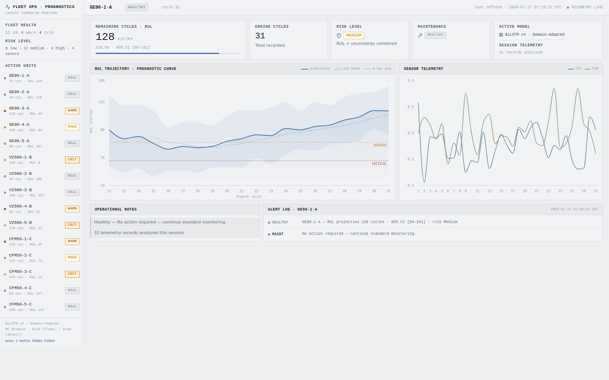

# Turbofan RUL — Aerospace Predictive Maintenance

Remaining Useful Life (RUL) prediction for turbofan aircraft engines, trained
on NASA's C-MAPSS dataset. A domain-adapted Bidirectional LSTM predicts how
many flight cycles an engine has left, with Monte Carlo Dropout providing a
calibrated uncertainty estimate on every prediction — served through a FastAPI
backend to a React fleet-monitoring dashboard.



## What this actually does

Given an engine's sensor telemetry history, the model predicts:
- **Remaining Useful Life** (in flight cycles) — a point estimate
- **Uncertainty** on that estimate, via 50 stochastic Monte Carlo Dropout
  forward passes, not a single deterministic guess
- A derived **risk level** (Low / Medium / High / Severe) that combines the
  RUL estimate with its uncertainty — a confident "RUL=140" and an uncertain
  "RUL=75 ± 25" are both real risk signals, not just the raw number
- A **maintenance recommendation** (Healthy / Inspection Recommended /
  Maintenance Required / Critical) with a concrete recommended action

The risk level and maintenance recommendation are pure post-hoc business
logic layered on top of the model's (mean, std) output — see
`src/turbofan_rul/inference.py` — not additional model outputs. They exist so
the uncertainty estimate actually *does* something: a moderate RUL prediction
with high uncertainty gets treated more conservatively than the point
estimate alone would suggest.

## Results

Measured on the real held-out C-MAPSS test set (707 engines across
FD001–FD004), using the deployed checkpoint (see [MODELS.md](MODELS.md)):

| Metric | Value |
|---|---|
| RMSE | ~21.2 cycles |
| MAE | ~14.8 cycles |
| R² | ~0.80 |
| NASA Score | ~17k–30k (lower is better; asymmetric penalty for late predictions) |

Going from the v1 baseline to v4 (see `docs/experiments/`), RMSE dropped
~28% and R² improved from 0.61 to 0.80 — almost entirely attributable to
domain adaptation, since v1/v2's biggest blind spot was normalizing sensor
readings identically across all 6 operating-condition regimes FD002/FD004
actually fly under.

## Architecture

```
NASA C-MAPSS (FD001-FD004)
        │
        ▼
┌───────────────────────────────────────────┐
│  Preprocessing (src/turbofan_rul/data.py)  │
│  • RUL labeling (piecewise-linear, clip 150)│
│  • KMeans(k=6) operating-condition clusters │
│  • Per-condition MinMax scaling             │
│  • 30-cycle sliding-window sequences        │
└───────────────────────────────────────────┘
        │
        ▼
┌───────────────────────────────────────────┐
│  BiLSTM v4 (src/turbofan_rul/model.py)     │
│  sensor_input(30,14) ──▶ BiLSTM(64)         │
│                       ──▶ BiLSTM(32) ─┐     │
│  condition_input(1) ──▶ Embedding(8) ─┴▶Dense│
│  loss: asymmetric Huber (2x penalty on late │
│        predictions — see losses.py)         │
└───────────────────────────────────────────┘
        │
        ▼
┌───────────────────────────────────────────┐
│  MC Dropout inference (inference.py)        │
│  50x forward passes, dropout active         │
│  → (mean RUL, uncertainty std)              │
│  → risk level + maintenance recommendation  │
└───────────────────────────────────────────┘
        │
        ▼
┌──────────────────┐        ┌──────────────────────┐
│  FastAPI backend   │◀─────▶│  React + TS dashboard │
│  (backend/app/)    │  REST │  (frontend/)          │
└──────────────────┘        └──────────────────────┘
```

## Folder structure

```
├── src/turbofan_rul/     Shared pipeline: config, data, model, losses, inference
│                         (imported by both training and serving — one implementation)
├── training/
│   ├── train_v4.py        Training script (the current production model)
│   └── plots.py            Evaluation plot generation
├── scripts/
│   └── evaluate.py         Load a trained model, report regression + classification metrics
├── backend/
│   ├── app/main.py         FastAPI server
│   └── tests/test_api.py   Integration tests (require real data + model)
├── frontend/               React + TypeScript + Vite dashboard
├── docs/
│   ├── experiments/         v1/v2 training script history + writeup
│   └── screenshots/
├── tests/test_pipeline.py  Unit tests (synthetic data, no external files needed)
├── MODELS.md               Model provenance — read this before wondering which .keras to use
├── requirements.txt
├── Dockerfile / docker-compose.yml
└── .github/workflows/ci.yml
```

## Getting started

### Prerequisites

You need two things this repo doesn't ship (see `.gitignore` — they're large,
user-specific binaries):

1. **The dataset** in `data/` — see `data/README.md`
2. **A trained model** at `turbofan_rul_v4.keras` in the repo root — either
   train one yourself (below) or use an existing one. **Read
   [MODELS.md](MODELS.md) first** if you have multiple candidate `.keras`
   files lying around; it documents a real gotcha with checkpoint vs. final
   saves that will silently cost you model quality if you pick the wrong one.

### Install

```bash
pip install -r requirements.txt
pip install -e .          # installs src/turbofan_rul as an importable package
```

### Train (optional — skip if you already have a model)

```bash
python training/train_v4.py
```

Writes `turbofan_rul_v4.keras`, `best_turbofan_v4.keras`, evaluation plots,
and persists the domain-adaptation artifacts to `artifacts/domain_adaptation.joblib`
so the backend doesn't need to refit them.

### Run the backend

```bash
cd backend
uvicorn app.main:app --reload --port 8000
```

Configuration is via environment variables — see `backend/app/config.py` for
the full list (data path, model path, MC Dropout sample counts, CORS origins,
etc.), all with sensible local-dev defaults.

### Run the frontend

```bash
cd frontend
npm install
npm run dev
```

Opens on `http://localhost:5173`, proxying `/api` to the backend on `:8000`
(see `frontend/vite.config.ts`).

### Or run everything with Docker

```bash
docker compose up --build
```

Backend on `:8000`, frontend on `:3000`. Requires `data/` and
`turbofan_rul_v4.keras` to already be present locally (mounted as volumes,
not baked into the image).

## API reference

| Endpoint | Description |
|---|---|
| `GET /api/health` | Liveness check + whether the model loaded successfully |
| `GET /api/engines` | Curated fleet (5 engines per C-MAPSS subset) with RUL, uncertainty, risk level, maintenance recommendation |
| `GET /api/engines/{unit_id}/telemetry` | Sensor history + 20-point RUL degradation trajectory with confidence bands for one engine |
| `GET /api/fleet/summary` | Fleet-wide risk/status/maintenance-category breakdown |

## Testing

```bash
pytest tests/                              # fast, synthetic data, no setup needed
pytest -m integration backend/tests/       # requires real data/ + turbofan_rul_v4.keras
```

CI (`.github/workflows/ci.yml`) runs the fast unit suite plus frontend
lint/type-check/build on every push — the integration suite needs real data
and weights that aren't (and shouldn't be) committed to git, so it's meant to
be run locally.

## Tech stack

**ML:** TensorFlow/Keras, scikit-learn, pandas, NumPy
**Backend:** FastAPI, Uvicorn, Pydantic
**Frontend:** React, TypeScript, Vite, Recharts, Tailwind
**Dataset:** [NASA C-MAPSS Turbofan Engine Degradation Simulation](https://www.nasa.gov/intelligent-systems-division/discovery-and-systems-health/pcoe/pcoe-data-set-repository/)

## Further reading

- [`MODELS.md`](MODELS.md) — which `.keras` file to use and why it matters
- [`docs/experiments/README.md`](docs/experiments/README.md) — the v1 → v2 → v4 iteration history

## License

MIT — see [LICENSE](LICENSE). The NASA C-MAPSS dataset itself is not included
and is subject to its own terms (see `data/README.md`).
